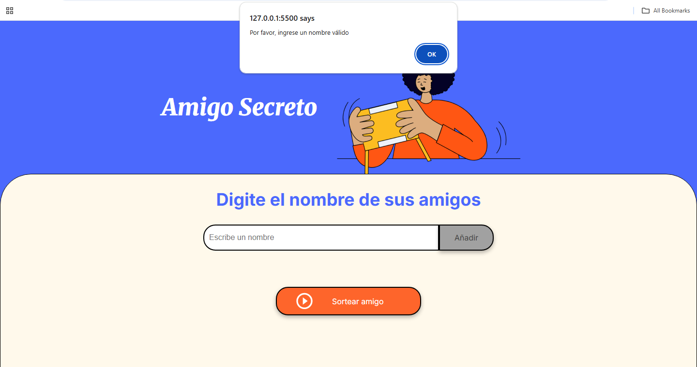
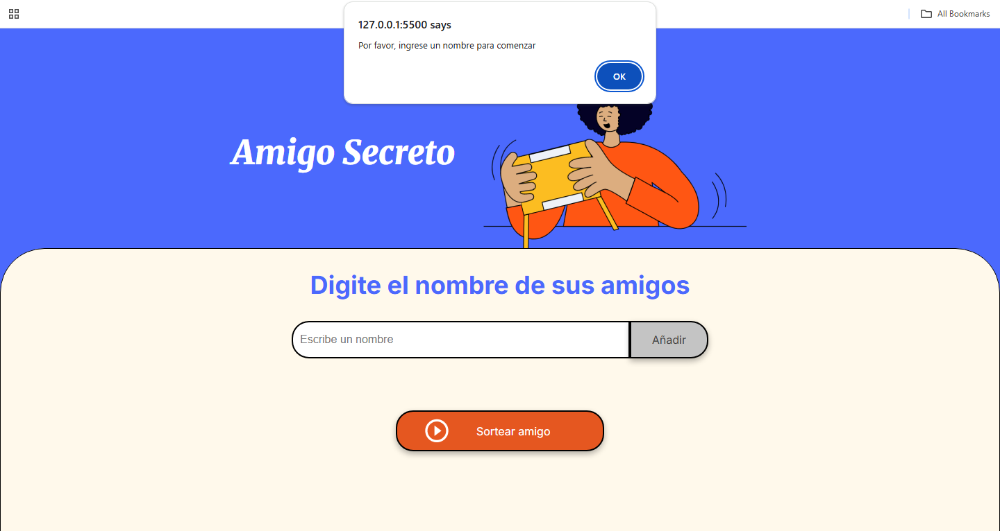
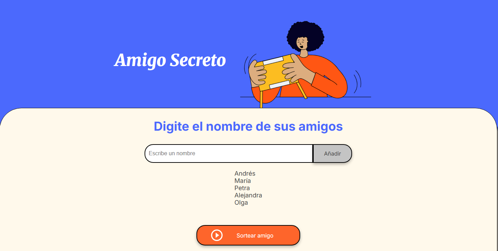
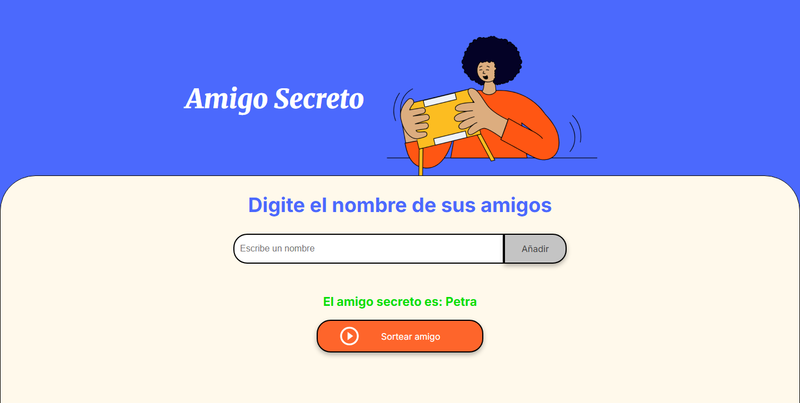
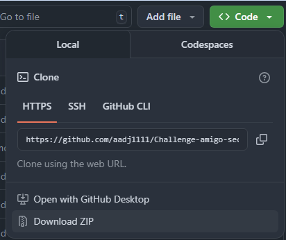
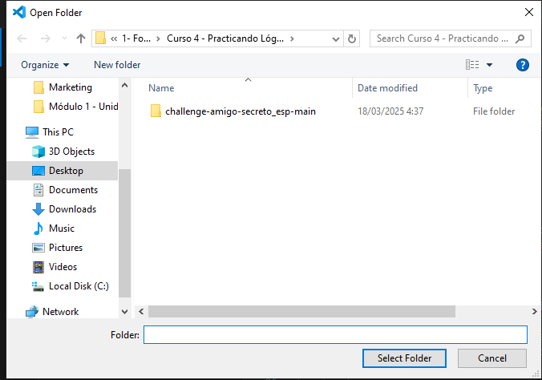
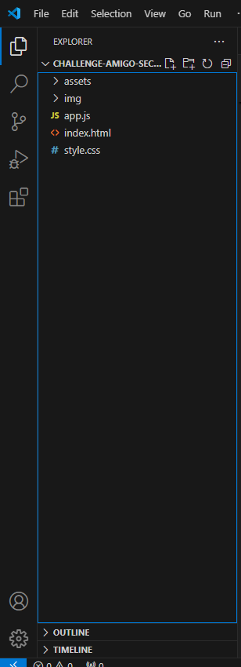
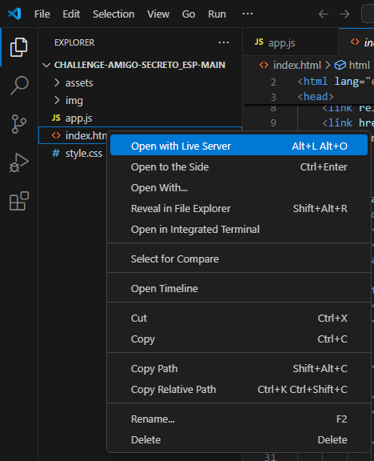

  

<h1 align="center"> Challenge Amigo Secreto </h1>

En el siguiente desafío, se desarrolló una aplicación que permite a los usuarios ingresar nombres de amigos en una lista para luego realizar un sorteo aleatorio y determinar quién es el <strong>"amigo secreto"</strong>.

De esa forma, el usuario deberá agregar nombres mediante un campo de texto y un botón <strong>"adicionar"</strong>. Los nombres ingresados se mostrarán en una lista visible en la página, y al finalizar, un botón <strong>"sortear amigo"</strong> seleccionará uno de los nombres de forma aleatoria, mostrando el resultado en pantalla.

<h2>Funcionalidad ⚙️ </h2>

 <strong>Agregar nombres:</strong> Los usuarios escribirán el nombre de un amigo en un campo de texto y lo agregarán a una lista visible al hacer clic en <em>"Añadir"</em>.

  

 <strong>Validar entrada:</strong> Si el campo de texto está vacío, el programa mostrará una alerta pidiendo un nombre válido.

  

 <strong>NOTA:</strong> En caso de que no se haya ingresado algún nombre y, quiera sortearse el amigo secreto... Aparecerá el siguiente mensaje

  

 <strong>Visualizar la lista:</strong> Los nombres ingresados aparecerán en una lista debajo del campo de entrada.

  

 <strong>Sorteo aleatorio:</strong> Al hacer clic en el botón <em>"Sortear Amigo"</em>, se seleccionará aleatoriamente un nombre de la lista y se mostrará en la página.

  

<h2>Comenzando 🚀</h2>

 <strong>A continuación, te diré como hacer las pruebas desde tu computadora </strong>

<h3>Paso 1: descarga el archivo .zip</h3>

  

<h3>Paso 2: abre la carpeta del proyecto en el VSC</h3>

  

<h3>Paso 3: selecciona la carpeta del proyecto</h3>

  

<h3>Paso 4: Ejecuta el Open Live Server</h3>

 para ello, dirígete a la columna izquierda y busca el index.html

  

 haz clic dereho y, tendrás el siguiente menú desplegable

  

<h3>Paso 5: Ahora sí ¡A jugar!</h3>

  

<h2>Construido con 🛠️ </h2>

Lógica de programación: 

Estructura y diseño de la página: 

Estilo visual: 

<h2>Autor ✒️</h2>
Andrés Duque
